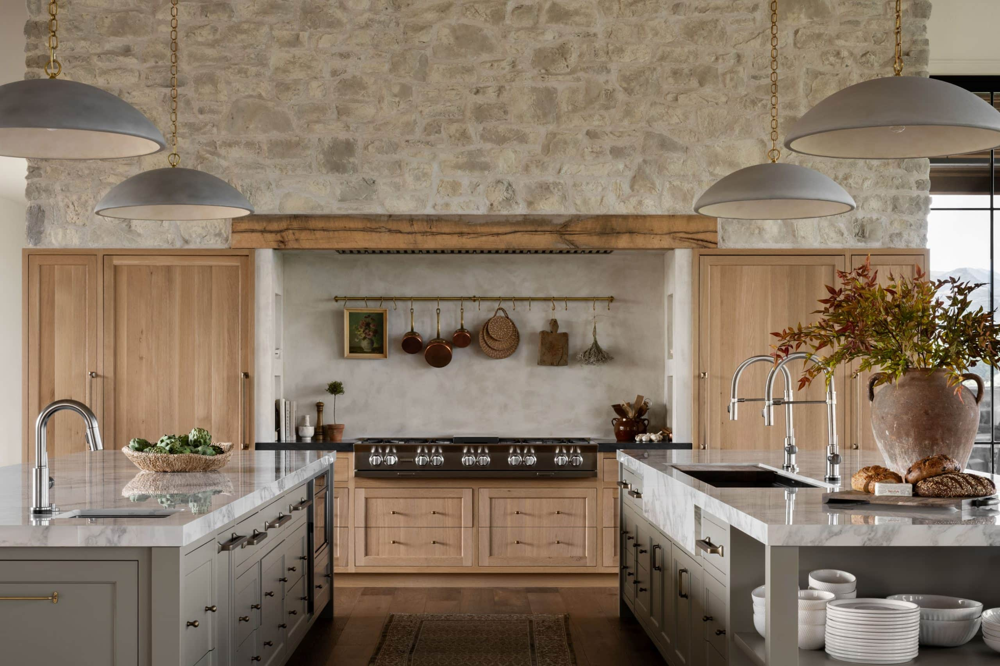

# Ruberto Contracting

Single-page marketing site for **Ruberto Contracting** — a general contracting and
finish-carpentry business serving York Region, Ontario. Visual direction: **"Atelier"**, a
premium-craftsman editorial aesthetic (large serif display, warm off-white paper, espresso accent).

Built as plain, dependency-free **HTML + CSS**. No build step.

## Structure

```
index.html      # the page (all markup)
style.css       # design tokens + all styles
images/         # project photos (see below)
```

## Run locally

Just open `index.html` in a browser, or serve the folder:

```sh
python3 -m http.server 8000   # then visit http://localhost:8000
```

## Adding real photos

The design ships with dashed placeholder boxes where photos go. To use real images:

1. Drop files into `images/` (e.g. `hero.jpg`, `project-1.jpg` … `project-4.jpg`).
2. In `index.html`, replace each `<div class="photo …">…</div>` placeholder with an ``:

   ```html
   
   <!-- and for the gallery -->
   
   ```

   `object-fit: cover` is already applied to `img.photo`, so any aspect ratio crops cleanly.
   Suggested sizes: hero ≈ 16:9 (e.g. 1600×900), gallery ≈ 3:2 (e.g. 1200×800).

## Contact details

The contact section lists `alessandro.ruberto@icloud.com` (both the "Email the Studio"
button and the Email row) and the phone `416 559 0294`. Update these in `index.html` if
they change — the email appears in two `mailto:` links and the phone in one `tel:` link.

## Deployment (GitHub Pages)

This repo is configured to deploy automatically via GitHub Actions
(`.github/workflows/pages.yml`) on every push to `main`. To enable:

**Settings → Pages → Build and deployment → Source: GitHub Actions.**

The site then publishes at `https://pauloruberto.github.io/ruberto-contracting/`.
A custom domain (e.g. `rubertocontracting.com`) can be added later under Settings → Pages.
